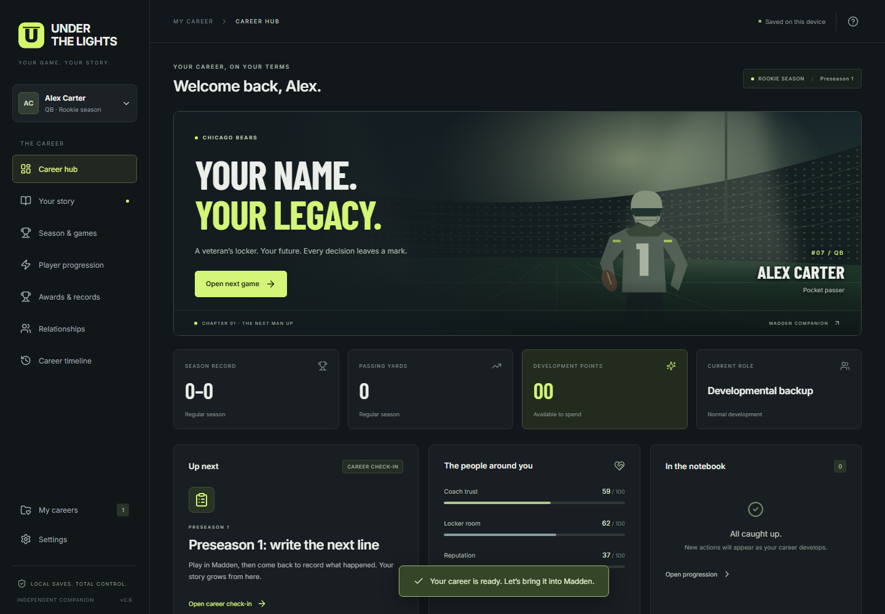
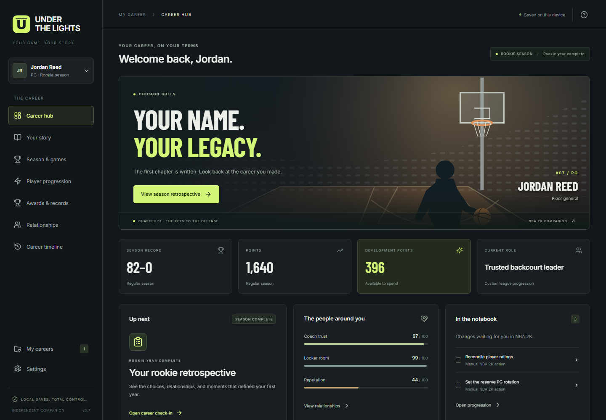
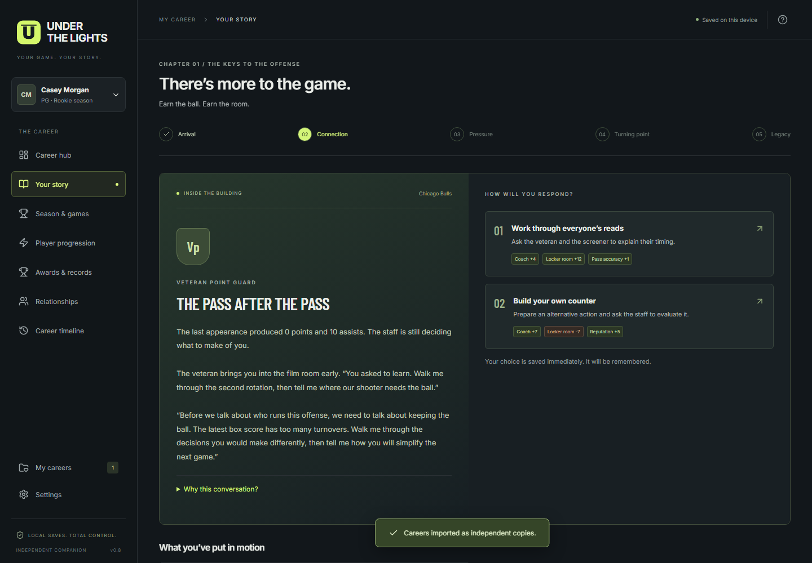
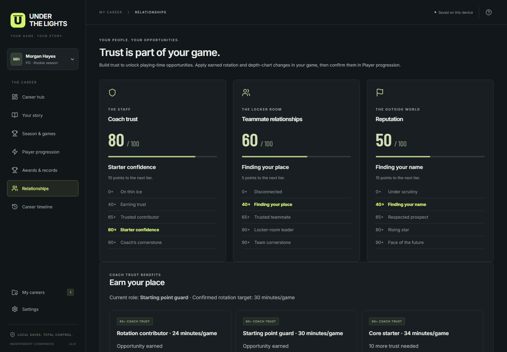
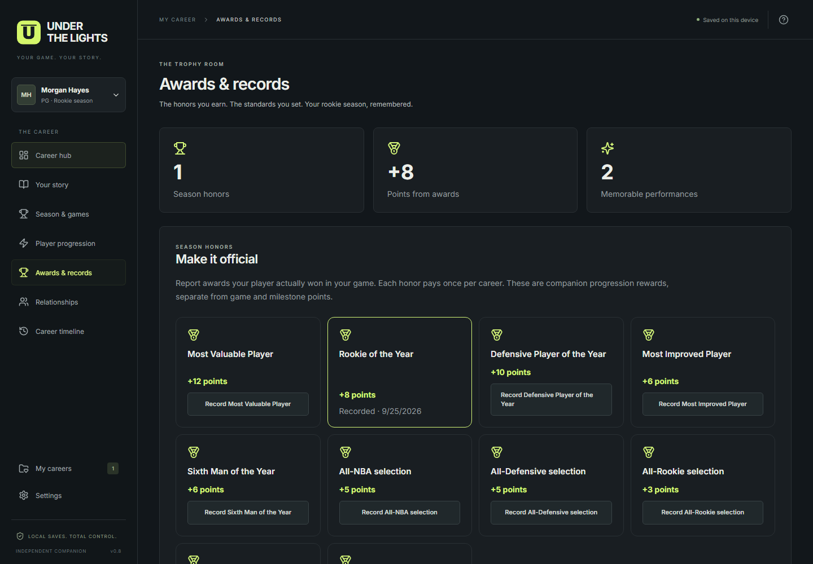
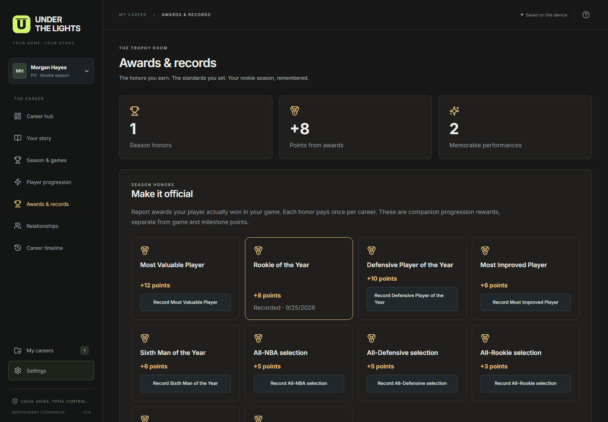

# Under the Lights

### Play the game. Own the story.

You just had the game of your life. Your career should remember it.

**Under the Lights** gives your Madden and NBA 2K player a life beyond the box score. Fight for a starting spot. Win over the locker room. Make a promise to your coach—and then go out and deliver. Build a rookie season that feels like it belongs to _your_ player.

Play your games in Madden Franchise or an editable NBA 2K league. Come back here to record what happened, face the conversations that follow, and decide what comes next.

**Two sports. Eight positions. Fifteen branching rookie stories. Twenty-four player builds. One career library.**

[**Download for Windows 11 · v0.8.0**](releases/Under%20the%20Lights_0.8.0_x64-setup.exe) · [Getting started](#your-first-season-starts-here) · [Setup & game guide](docs/GUIDE.md)



_Your next game, your people, your progress—all in one place._

## A career worth coming back to

The final whistle should start a conversation.

A rough stretch can put your decision-making under the microscope. A big night can put you in front of the microphones. Back up your words, and the coach may trust you with a bigger role. Make a different choice, and the next conversation can go somewhere else.

Under the Lights connects those moments with authored stories, persistent relationships, performance-based progression, and a record of the decisions you made along the way.

It runs locally. **No account. No required AI service. No paid progression inside the companion.** Your points come from playing, reaching milestones, and earning honors.

## Choose your game. Find your role.

### Madden: seven positions, fourteen stories

Build a pocket passer, a deep threat, a back who can turn a checkdown into a touchdown, or the defender who changes the entire game. Every supported football position has **three archetypes and two distinct rookie storylines**.

| Position          | Your two stories                                 |
| :---------------- | :----------------------------------------------- |
| **Quarterback**   | _The next man up_ · _Beyond the playbook_        |
| **Wide receiver** | _Earn every snap_ · _More than a highlight_      |
| **Running back**  | _Earn the carry_ · _More than a checkdown_       |
| **Tight end**     | _Between two rooms_ · _The quarterback’s answer_ |
| **Safety**        | _The last line_ · _A place in the defense_       |
| **Linebacker**    | _The voice in the huddle_ · _Stay on the field_  |
| **Edge rusher**   | _Rush hour_ · _Hold the edge_                    |

Work through the draft, three preseason games, eighteen regular-season weeks with a bye, and an optional playoff run. Whether the season ends early or with a championship, your rookie retrospective brings the journey together.

### NBA 2K: earn the keys to the offense

The first basketball chapter puts you at **point guard**, competing with a veteran for control of the offense.

Choose **Floor general**, **Scoring guard**, or **Two-way guard**, then step into _The keys to the offense_. Earn the ball, handle the pressure, and decide what kind of leader you want to become.

Play an **8–82-game regular season**, with story pacing that adjusts to your schedule. Qualify for the postseason and chase a title through **four best-of-seven series**.



_Football and basketball saves live together. Every player keeps their own story, stats, relationships, and progress._

## Build the player you want to become

Choose your position, archetype, height, weight, and attribute allocations. Preview your **starting ratings and separate rating ceilings** before you commit. Madden builds also include a development trait.

You get twelve build points to shape your starting player. Once the career begins, progression becomes something you earn:

- **1–5 development points per played game**, based on position-specific production, efficiency, impact, and mistakes.
- **Milestone bonuses** for meaningful season achievements.
- **Season-award bonuses** for honors you report from your actual game.
- **Clear upgrade costs and rating ceilings**, so you can see what every point buys.

The recap form previews your reward before you save. The progression screen shows the exact ratings to apply in your game, including what needs reconciling after automatic in-game growth.

## Your numbers change the conversation

Turnovers, assists, touchdowns, drops, sacks—the story pays attention.

Conversations use authored reactions selected from your recorded performance. A coach can question your ball security, a teammate can recognize your playmaking, and a strong stretch can change the tone around your player. It all works **offline, without AI-generated dialogue**.

Choices have visible consequences: coach trust, teammate relationships, reputation, promises, conflicts, role opportunities, and sometimes a request for a fresh start.



_Pick your response. The app saves the conversation, the evidence behind it, and what you decided._

Curious why someone is talking about a particular part of your game? Open **Why this conversation?** to see the stats behind the reaction. Once a conversation is resolved, later recap corrections cannot rewrite it.

## Some games deserve their own chapter

A leap from five points a night to fifteen means something different from a seventy-five-point explosion. The app recognizes **four levels of performance**:

| Caliber         | What makes it special                                                                              |
| :-------------- | :------------------------------------------------------------------------------------------------- |
| **Breakout**    | A meaningful jump beyond your usual production—like averaging 5 points, then putting up 15.        |
| **Standout**    | An elite game for your position—like a 45-point night or 15 assists.                               |
| **Exceptional** | Rare production, such as 75 points or 500 passing yards.                                           |
| **Historic**    | Beating a league record in your save’s record book. A personal best or a tie alone does not count. |

Breakout comparisons need at least three prior played games in the same phase. Every position has its own thresholds, and the highest qualifying tier wins.

A big performance can open an optional **press conference, coach meeting, or locker-room conversation**. Breakout and standout events have a cooldown; exceptional and historic games always queue a conversation. You can respond, leave it for later, or skip without a penalty.

## Earn the coach’s trust. Earn your spot.

Coach trust, teammate relationships, and reputation each have **five visible tiers**, with progress toward the next one.

Coach trust also unlocks concrete playing-time opportunities:

| Coach trust                   | NBA 2K opportunity                     | Madden opportunity |
| :---------------------------- | :------------------------------------- | :----------------- |
| **65+ · Trusted contributor** | Rotation role · 24 minutes/game        | Regular rotation   |
| **80+ · Starter confidence**  | Starting point guard · 30 minutes/game | Starting spot      |
| **90+ · Coach’s cornerstone** | Core starter · 34 minutes/game         | Featured starter   |



_Those conversations can lead to a bigger role. Earned opportunities remain unlocked if trust later drops._

Apply the rotation or depth-chart edit in your game, then confirm it in **Player progression**. If the edit is unavailable—or you already have a bigger role—record that instead. NBA minute targets assume twelve-minute quarters and can be scaled for shorter games. Teammate and reputation tiers describe your standing in the story; coach tiers grant the playing-time benefits above.

## Give the big moments a home

The **Awards & records** screen is your trophy room.

Report the honors your player actually wins: Rookie of the Year, MVP, Defensive Player of the Year, All-NBA, All-Pro, and other game-appropriate awards. Regular-season honors unlock after the regular season; championship MVP requires a completed run to the final round.

Each honor grants its displayed bonus **once per career**. MVP pays **12 points**, Rookie of the Year **8**, and player-of-the-year honors **10**.



Track personal game highs, season totals, memorable performances, and league marks. Regular-season, preseason where applicable, and postseason personal records are kept separate.

The league book includes selected sourced starter records, and you can edit or add game and season marks to match your own league or era. It is your save’s record book—not a live feed of every NBA or NFL record.

## Your first season starts here

1. **Choose Madden or NBA 2K.** Create your player and choose an available story.
2. **Set up your league.** Follow the checklist to create or edit a draft prospect in Madden Franchise or an editable NBA 2K league mode.
3. **Let the game run the draft.** Enter the actual team, round, and pick in the companion.
4. **Play, then recap.** Record the result and position-specific stats. Injuries, missed games, and football bye weeks are supported.
5. **Live with your choices.** Resolve story moments, respond to optional side events, and work toward the role you want.
6. **Spend what you earn.** Apply rating, rotation, or depth-chart changes manually. Trade requests stay unresolved until you report what actually happened.
7. **Finish your rookie year.** Record your awards, review your records, and look back at the decisions that defined the season.

**This is a companion to your game.** It does not read game files, control your player, or apply edits automatically. Madden 26 and NBA 2K26 are the starting use case; the manual workflow is designed around editable league saves rather than an edition-specific integration. Editing options depend on the edition and mode you use.

## Make it feel like your career

Switch between **Sports Broadcast** and **Cinematic Career Hub** in Settings. Both give you the same career tools, with different visual treatments. Bundled artwork and fonts keep the presentation available offline, and keyboard controls and reduced-motion support let you use it your way.

<details>
<summary><strong>See the cinematic presentation</strong></summary>



</details>

Screenshots throughout this page are captures of the running app using example careers, not design mockups. Some captures show earlier version labels.

## Keep every save yours

Run multiple careers without mixing up their histories. Try the other storyline. Start a different position. Keep your quarterback and your point guard in the same library.

- **Local desktop saves** backed by SQLite.
- **Automatic recovery points** retaining the ten most recent backups.
- **Export/import** for keeping an archive or moving careers between the browser preview and desktop app.
- **Recap corrections** that update stats while preserving earned rewards and resolved story history.
- **A permanent timeline** of games, choices, upgrades, and reported outcomes.
- **Atomic saving:** completed steps are saved together, so a failed write leaves the previous state intact.

## Get under the lights

[**Download the Windows 11 x64 installer**](releases/Under%20the%20Lights_0.8.0_x64-setup.exe)

Install and launch. No developer tools are required to play. The installer is currently unsigned.

**Current release: v0.8.0.** The playable career ends after the rookie season. Madden has seven positions and fourteen stories; NBA 2K currently has point guard and one story. Additional basketball positions, more storylines, and continued multi-season careers are future work.

### Want to run or build it yourself?

Built with **Tauri 2, React, TypeScript, and SQLite**.

```powershell
pnpm install --frozen-lockfile
pnpm dev
```

Use Node.js 22+ and pnpm, then open [the local preview](http://127.0.0.1:1420). Browser saves use IndexedDB and are separate from desktop saves; export/import transfers careers between them.

For Windows build prerequisites, detailed gameplay rules, progression balance, data files, save recovery, and verification commands, see the [setup & game guide](docs/GUIDE.md). Versioned rules and authored content live in `src/data`; the career engine lives in `src/domain`.

The v0.8 checks cover **331 unit tests, fifteen browser journeys, and native Windows save workflows**, including complete rookie seasons, choices, rewards, awards, and relationship-based role changes.

---

_Under the Lights is an independent companion project, not affiliated with EA, 2K, the NFL, or the NBA. You provide the game. You make the plays. You decide who your player becomes._
